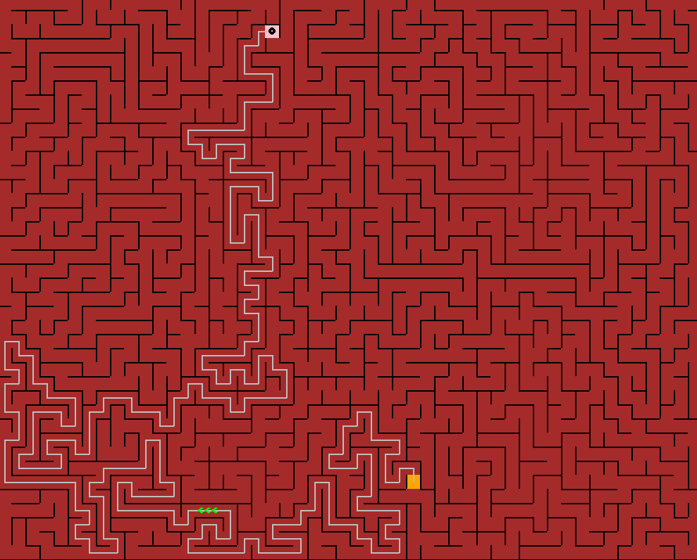

# Path-Finding-Visualize
A simple path finding visualization using A* path finding algorithm and maze generated by recursive back trenching algorithm.

# Features
* Use f to speed up and slow
* use s for constant 60 fps
* use g for generate
* use r for reseat
* use space for pause and play

